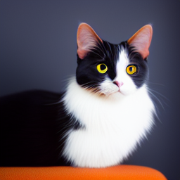

# stable-diffusion

pure go for stable-diffusion and support cross-platform.

[](https://pkg.go.dev/github.com/seasonjs/stable-diffusion)

sd.go is a wrapper around [stable-diffusion-cpp](https://github.com/leejet/stable-diffusion.cpp), which is an adaption
of ggml.cpp.

<p align="center">
  
</p>

## Installation

```bash
go get github.com/seasonjs/stable-diffusion
```

## Compatibility

See `deps` folder for dylib compatibility, push request is welcome.

| platform | x32         | x64                     | arm         |
|----------|-------------|-------------------------|-------------|
| windows  | not support | support avx/avx2/avx512 | not support |
| linux    | not support | support                 | not support |
| darwin   | not support | support  (no test)      | support     |

## Usage

This `stable-diffusion` golang library provide two api `Predict` and `ImagePredict`.
**You must instantiate each separately and set the correct options for the corresponding model.**

You don't need to download stable-diffusion dynamic library.

```go
package main

import (
	"os"
	"github.com/seasonjs/stable-diffusion"
)

func main() {
	options := sd.DefaultStableDiffusionOptions
	//It's important to set image size,different model support different size
	options.Width = 256
	options.Height = 256
	model, err := sd.NewStableDiffusionAutoModel(options)
	if err != nil {
		panic(err)
	}
	defer model.Close()
	err = model.LoadFromFile("./data/miniSD-ggml-model-q5_0.bin")
	if err != nil {
		panic(err)
	}
	file, err := os.Create("./data/output2.png")
	defer file.Close()
	if err != nil {
		panic(err)
	}
	err = model.Predict("A lovely cat, high quality", file)
	if err != nil {
		panic(err)
	}
}

```
```go
package main
import (
	"os"
	"github.com/seasonjs/stable-diffusion"
)

func main()  {
	options := sd.DefaultStableDiffusionOptions
	//It's important to set image size,different model support different size
	options.Width = 256
	options.Height = 256
	//ImagePredict model need set VaeDecodeOnly false
	options.VaeDecodeOnly = false
	model, err := sd.NewStableDiffusionAutoModel(options)
	if err != nil {
		panic(err)
	}
	defer model.Close()
	err = model.LoadFromFile("./data/miniSD-ggml-model-q5_0.bin")
	if err != nil {
		panic(err)
	}
	inFile, err := os.Open("./data/output2.png")
	defer inFile.Close()
	if err != nil {
		panic(err)
	}
	outfile, err := os.Create("./data/output3.png")
	if err != nil {
		panic(err)
	}
	defer outfile.Close()
	err = model.ImagePredict(inFile, "the cat that wears shoes", outfile)
}
```
If `NewStableDiffusionAutoModel` can't automatic loading of dynamic library, please use `NewStableDiffusionModel` method load manually.

```go
package main

import (
	"fmt"
	"runtime"
	"github.com/seasonjs/stable-diffusion"
)

func getLibrary() string {
	switch runtime.GOOS {
	case "darwin":
		return "./deps/darwin/libstable-diffusion_arm64.dylib"
	case "linux":
		return "./deps/linux/libstable-diffusion.so"
	case "windows":
		return "./deps/windows/stable-diffusion_avx2_x64.dll"
	default:
		panic(fmt.Errorf("GOOS=%s is not supported", runtime.GOOS))
	}
}
func main()  {
	options := sd.DefaultStableDiffusionOptions
	//It's important to set image size,different model support different size
	options.Width = 256
	options.Height = 256
	model, err := sd.NewStableDiffusionModel(getLibrary(),options)
	print(model,err)
	//.... the usage is same as `NewStableDiffusionAutoModel`. they both return `StableDiffusionModel` struct

}

```
## Packaging

To ship a working program that includes this AI, you will need to include the following files:

* libstable-diffusion.dylib / libstable-diffusion.so / stable-diffusion.dll (buildin)
* the model file
* the tokenizer file (buildin)

## Low level API

This package also provide low level Api which is same
as [stable-diffusion-cpp](https://github.com/leejet/stable-diffusion.cpp).
See detail at [stable-diffusion-doc](https://pkg.go.dev/github.com/seasonjs/stable-diffusion).

## Thanks

* [stable-diffusion-cpp](https://github.com/leejet/stable-diffusion.cpp)
* [ggml.cpp](https://github.com/leejet/ggml.cpp)
* [purego](https://github.com/ebitengine/purego)

## Successful Examples

<p align="center">
  
</p>

## License

Copyright (c) seasonjs. All rights reserved.
Licensed under the MIT License. See License.txt in the project root for license information.